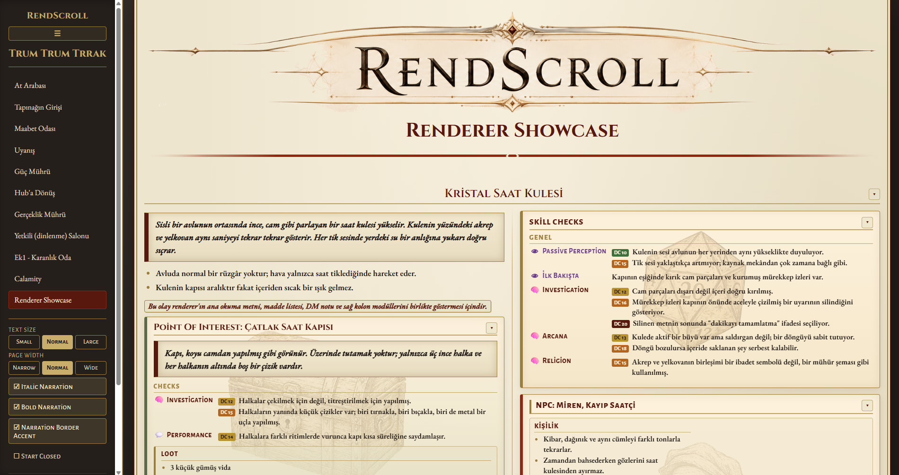

<div align="center">

# ✦ RendScroll ✦

### *Every page hides a deeper room.*

**Turn your campaign notes into a Dungeon Master's screen you actually want to run from.**

<br />



*Plain notes go in. An old, gold-edged book comes out — ready for the table.*

</div>

---

## 📜 What is this?

You already write your sessions down. Scattered notes, half-formed scenes, a stat
block here, a line of dialogue there. RendScroll gathers all of it and hands it back
to you as something that *feels* like sitting down with a leather-bound tome — warm
parchment, deep bordeaux, ink-and-gold headings, and a quiet hush that says *the
game is about to begin.*

You don't learn a tool. You write the way you already think — top to bottom, in the
order the scene happens — and RendScroll renders it into a page you can run a table
from at a single glance.

No accounts. No cloud. No setup ritual. Just your world, opened like a book.

---

## ⚔️ Why it feels good at the table

- **The page reads itself, in play order.** Scenes flow top to bottom, event by
  event — no flipping between sections mid-encounter to find what happens next.

- **Two columns, your call.** Everything flows down the **left** by default; send any
  card to the **right** — your toolbox lane for NPCs, skill checks, loot, and stat
  blocks — with a single `Side: R` line, so it waits exactly where your eyes land.

- **Never read the wrong line again.** What players hear *glows apart* from your
  secret DM notes. Read-aloud text is clean and unmistakable; your hidden truths stay
  yours.

- **Every moment has a card that knows what it is.** NPCs, combat, skill checks,
  items, spells, objects, and the unexpected each carry their own look and color —
  so a fight never reads like a footnote.

- **Tune the mood, live.** Text size, page width, narration style, cards open or
  closed — set the table's atmosphere with a click, and it remembers.

- **Write, edit, and print without leaving.** Adjust a scene right in the page, then
  export a clean PDF to lay beside your dice.

- **Yours, and offline.** It runs entirely on your machine. Your world never leaves
  the room.

---

## ✨ A glance at the magic

The secret is that there's no secret — it's **just Markdown.** You write a scene the
way it reads in your head:

```md
## Crystal Clock Tower
> In the middle of a mist-covered courtyard stands a slender clock tower that gleams like glass. The hour and minute hands on its face repeat the same second over and over again. With every ticking sound, the water on the ground briefly leaps upward.

`This encounter exists to showcase the renderer's main narrative text, bullet lists, DM notes, and right-column modules together.`

### Skill Checks
- Passive Perception:
> 10: The sound of the tower can be heard at the same volume from every part of the courtyard.
> 15: The ticking does not grow louder as you approach; its source seems tied to time rather than space.

- Investigation:
> 12: The glass was shattered inward, not outward.
> 16: The ink stains reveal that a hastily written warning at the doorway was deliberately erased.
> 20: The final words of the erased text appear to read: "do not let the minute finish."

### NPC: Miren, the Lost Clockmaker
Personality:
* Polite, absent-minded, and repeats the same sentence with different tones.
* Never takes their eyes off the clock tower when speaking about time.
  First Dialogue:

> "You're late. No, you're early. Actually... both happened at once."

Clock Tower:
- "What's inside the tower?"
> "A room, a table, a bell, and the final minute that never ends."

Checks:
- Insight:
> 12: Miren is not lying, but their memories do not arrive in the correct order.
> 16: What they fear is not the tower itself, but the completion of the minute within.

### Object: Cracked Clock Door

> The door appears to be made of dark glass. It has no handle—only three thin rings, each with an empty scratch carved beneath it.

Checks:
- Investigation:
> 12: The rings were designed to vibrate, not to be pulled.
> 15: Small scratches surround the rings; one made by a fingernail, one by a blade, and one by a metal tip.

- Performance:
> 14: Striking the rings with different rhythms causes the door to become transparent for a brief moment.

Loot:
- 3 small silver screws
- A broken pocket watch cover
- A thin metal strip engraved with the words: "The final minute is a debt."

### _item: Hourglass of Reversed Sands
Type: Wondrous Item
Rarity: 2
Attunement: Required

> The black sand inside the upper chamber of this palm-sized hourglass flows upward instead of down. Its glass is cold to the touch, and up close the grains shimmer like tiny stars.

Properties:
- Once per long rest, after failing a Dexterity saving throw, you may reroll the die.
- You must use the new result.
- After being used, the hourglass becomes completely dark for 1 minute.

### Unexpected:
- If the players attempt to break the door: the glass does not shatter; instead, the ticking throughout the courtyard accelerates for one round.
- If they attack Miren: Miren takes damage, but returns to their original position with the next tick of the clock.

```

…and RendScroll turns it into a glowing read-aloud box, a hidden DM note only you can
see, and a combat card with its stats laid out at a glance. That's the whole spell.

---

## 🕯️ Step inside

1. Run **`launcher.py`** (or the bundled **`RendScroll.exe`**).
2. It quietly checks your campaign files, then opens RendScroll in its own window.
3. Pick a scene from the side and start reading.

That's it — you're at the table.

---

<div align="center">

*Close the book when you're done. The deeper rooms will keep.*

**RendScroll** — by yagizdkurt

</div>
