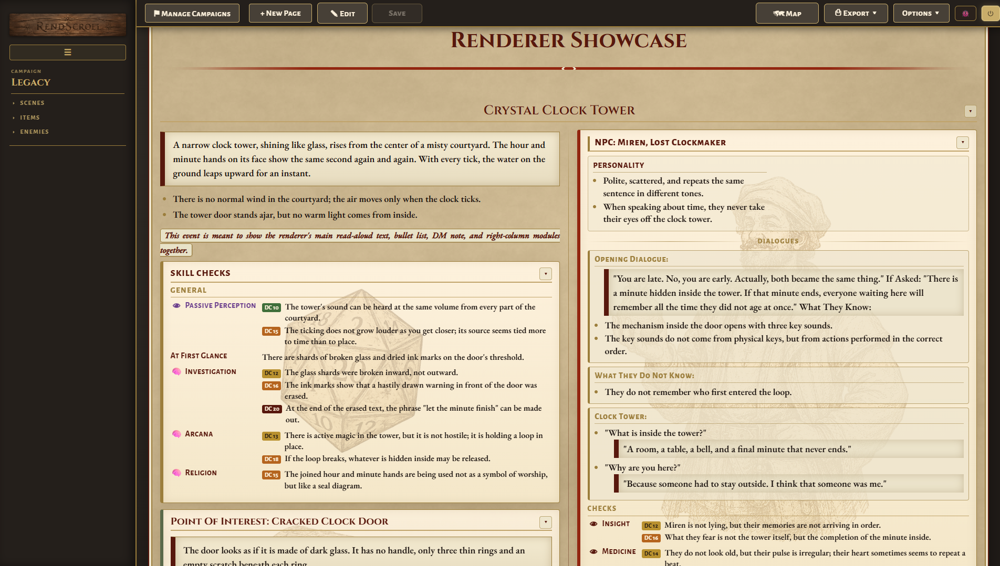

# ✦ RendScroll ✦

**Turn your campaign notes into a Dungeon Master's screen you actually want to run from.**

**Yours, Free and Offline. It runs entirely on your machine. No accounts, no cloud, no setup ritual. Just your world, opened like a book.**

 

*Plain notes go in. An old, gold-edged book comes out — ready for the table.*

---

## ⚙️ HOW TO RUN:

1. Run **`python launcher.py`**. (If you are having good time with python you should be able to open it with double clicking. If not then open console and write "python launcher.py" and it will open.)

That's it — you're at the table.

---

## 🆕 Whats new (1.4 Map and Flow Update)

- Added a map renderer where you can choose when or where to transition from location 1 to location 2.

---

## ⚔️ Why it feels good at the table

- **complete DM workbench** — write, build, reuse, all from the same book.

- **The page reads itself, in play order.** Scenes flow top to bottom, event by event — no flipping between sections mid-encounter to find what happens next.

- **A real visual editor — no Markdown required.** Flip on edit mode and shape any card through clean forms: pick the type, fill the fields, drop it exactly where it
  belongs.

- **Iconography that reads at a glance.** Standardized **damage-type icons**, dice, AC/HP/initiative crests — stat blocks parse in the half-second you actually have.

- **Tune the mood** Customizable style, cards open or closed, **dark or light chrome,** even a **custom parchment of
  your own** — set the table's atmosphere.

- **Libraries** Do not write your items or enemies again and again or copy paste them. With libraries you can write an enemy once and use it in every campaign whenever you like.

- **Write, edit, print or export** Adjust a scene right in the page, then **export a clean PDF** to lay beside your dice or export as campaign zip so that others can play it too. It even exports items and enemiess fully automated!

- **Combat helper.** Initiative and turn order helper is there so that you dont forget whos after who, also track every enemy's HP so that you dont need to do math in your papers.

---

## 🃏 The cards in your hand

**Every moment has a card that knows what it is.**

| Card | What it's for |
| --- | --- |
| **Narrative** | Read-aloud boxes that glow apart from your private notes |
| **NPC** | Personalities, dialogue trees, and quick checks in one block |
| **Skill Checks** | DC-by-DC reveals, shaded by difficulty |
| **Object** | Interactables, their checks, and the loot they hide |
| **Combat** | Stat blocks with a **live initiative + HP runner** |
| **Item** | Magic items, drawn from your reusable **Item Library** |
| **Ability / Spell** | Costs, ranges, cooldowns, and effects |
| **Unexpected** | The “what if the players…” branches you keep in your back pocket |
| **Audio** | Ready to set the ambiant music? Or some sound effects? |

---

**RendScroll** — by yagizdkurt

