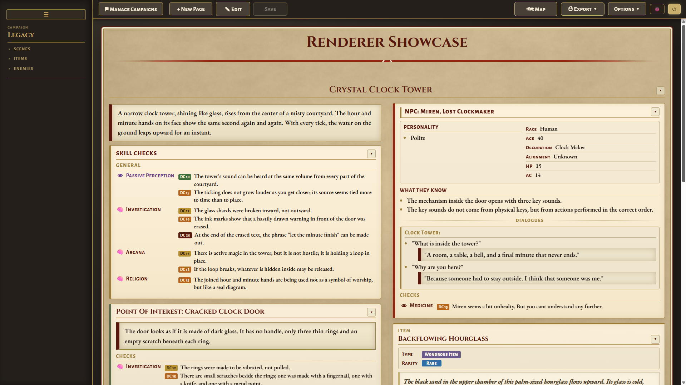

# ✦ RendScroll ✦

**Turn your campaign notes into a Dungeon Master's screen you actually want to run from.**

**Yours, Free and Offline. It runs entirely on your machine. No accounts, no cloud, no ritual. Just your world.**

 

*Plain notes go in. An old, gold-edged book comes out — ready for the table.*

---

## ⚙️ HOW TO RUN:

1. Run **`python launcher.py`**. (If you are having good time with python you should be able to open it with double clicking. If not then open console and write "python launcher.py" and it will open.)

## 🆕 Whats new (1.5 Browsers)

- Added support for firefox + edge.

## ⚔️ Why it feels good

- **complete DM workbench** — write, build, reuse, all from the same app.

- **Scene Mapper** Never forget "where does this road go to" again.

- **The page reads itself, in play order.** Scenes flow top to bottom, event by event — no flipping between sections mid-encounter to find what happens next.

- **A real visual editor** Shape any card through clean forms, pick the type, fill the fields, move it to place.

- **Good Iconography** Standardized **damage-type icons**, dice, AC/HP/initiative crests.

- **Libraries** Do not write your items or enemies again and again or copy paste them. With libraries you can write an enemy once and use it in every campaign whenever you like.

- **Print Or Export** Easily export a clean PDF to lay beside your dice or export as campaign zip so that others can play it too.

- **Combat helper.** Initiative and turn order helper is there so that you dont forget whos after who, also track every enemy's HP so that you dont need to do math in your papers.

---

## 🃏 Current Cards

| Card | Usage |
| --- | --- |
| **Narrative** | Narration that should be told to players |
| **NPC** | Personalities, dialogue trees and more |
| **Skill Checks** | DC-by-DC reveals, shaded by difficulty |
| **Object** | Interactables, their checks, and the loot they hide |
| **Combat** | Stat blocks with a **live initiative + HP runner** |
| **Item** | Item, yes. |
| **Ability / Spell** | Costs, ranges, cooldowns, and effects |
| **Unexpected** | The “what if the players…” branches you keep in your back pocket |
| **Audio** | Playable audio... Thats it... |

---

**RendScroll** — by yagizdkurt

